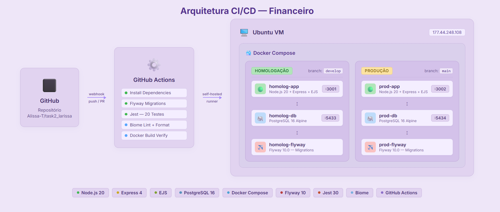

Aluna: Larissa Alissa Träsel

# 
Documentação de Arquitetura e CI/CD do Sistema Financeiro

## 1. Diagrama da Arquitetura

---

## 2. Acesso à Aplicação

### 2.1. Repositório GitHub
Acesso ao repositório:
https://github.com/Alissa-T/task2_larissa/

### 2.2. Endereços e Portas (VM)
A aplicação está hospedada em uma Máquina Virtual (VM) principal no IP **`177.44.248.108`**. O tráfego foi dividido em portas distintas para separar os ambientes físicos usando o Docker:

| Ambiente | URL de Acesso (Aplicação Web) | Porta do Banco de Dados Externo |
|---|---|---|
| **Homologação** | http://177.44.248.108:3001 | 5433 |
| **Produção** | http://177.44.248.108:3002 | 5434 |

### 2.3. Acesso Administrador Padrão
Para fins de testes, visualização da aplicação e correções iniciais, um usuário administrador padrão é semeado automaticamente no banco de dados através das migrações do Flyway:
* **Login:** `admin`
* **Senha:** `admin123`

---

## 3. Tecnologias Utilizadas no Processo de CI/CD

Abaixo está o detalhamento completo de toda a esteira tecnológica utilizada no projeto para garantir entregas contínuas com estabilidade, qualidade e "Zero-Downtime".

### 3.1. Ambiente (Infraestrutura)
A infraestrutura foi projetada para garantir isolamento e fácil replicação.
* **Sistema Operacional:** Ubuntu Server (Linux) – Proporciona alta estabilidade e segurança como host principal da aplicação.
* **Máquina Virtual (VM):** O sistema está hospedado na nuvem, recebendo os deploys automaticamente.
* **Contêineres:** **Docker** – Toda a aplicação foi dockerizada. Isso garante que o software rode exatamente da mesma forma no ambiente de desenvolvimento, homologação e produção, evitando o clássico problema "na minha máquina funciona".
* **Orquestração de Contêineres:** **Docker Compose** – Utilizado para definir e rodar aplicações multi-contêiner (Aplicação Node + Banco de Dados + Migrações Flyway) de forma orquestrada e simplificada.

### 3.2. Linguagem de Programação e Banco de Dados
* **Linguagem Principal:** **JavaScript (Node.js)** – Utilizada para construir toda a camada de back-end (API Rest) e processamento lógico usando o framework **Express.js**. No front-end, utiliza-se HTML, CSS e JavaScript nativo (Vanilla JS).
* **Banco de Dados:** **PostgreSQL** – Um banco de dados relacional robusto e escalável. 
* **Migração de Banco de Dados:** **Flyway** – Utilizado para versionar as tabelas e dados do PostgreSQL. O Flyway garante que a estrutura do banco evolua de forma controlada através de scripts `.sql` ao longo das versões.

### 3.3. Ferramentas para Controle de Mudança e Versionamento
* **Versionamento de Código:** **Git** – Ferramenta principal para controle de versão, permitindo a criação de ramificações (branches) para desenvolvimento de novas features e resolução de bugs de forma assíncrona.
* **Hospedagem de Código:** **GitHub** – Plataforma base para hospedar os repositórios, promover o trabalho colaborativo (via Pull Requests) e ser o coração de toda a engrenagem de CI/CD.
* **Padrão de Branches:** O projeto utiliza branches isoladas como `develop` (para Homologação) e `main` (para Produção), mantendo os ambientes protegidos e testados.

### 3.4. Integração Contínua e Entrega Contínua (CI/CD)
* **Motor de Automação:** **GitHub Actions** – Responsável por executar os "Pipelines". Sempre que um novo código é enviado para as branches principais, o GitHub Actions dispara "robôs" que constroem, testam e fazem o deploy automático do sistema na Máquina Virtual.
* **Deploy Zero-Downtime:** A esteira foi configurada de forma inteligente com Docker Compose para atualizar apenas o aplicativo web, sem desligar o banco de dados, garantindo que o sistema fique disponível sem quedas durante a atualização.

### 3.5. Testes e Qualidade de Código
A qualidade de software é garantida antes de qualquer deploy:
* **Testes Automatizados:** **Jest** – Framework de testes em JavaScript usado para garantir o funcionamento interno das lógicas do sistema. Se um teste falhar no pipeline (CI), o deploy é bloqueado automaticamente para não enviar código com falhas ao cliente.
* **Linter e Formatação:** **Biome** – Ferramenta moderna e ultra-rápida usada no pipeline para analisar o código escrito, encontrar erros de sintaxe ou variáveis inutilizadas e garantir que todos os programadores sigam o mesmo padrão visual e estrutural.

### 3.6. Demais Ferramentas
* **Gerenciador de Pacotes:** **NPM** (Node Package Manager) – Usado para gerenciar todas as bibliotecas e dependências da aplicação.
* **Criptografia:** **Bcrypt** – Usado na aplicação para garantir o "hash" (criptografia) seguro das senhas dos usuários no banco de dados.
* **Comunicação Web:** **Fetch API** – Usada nativamente no Front-end para realizar as requisições HTTP para a API Node.js.
